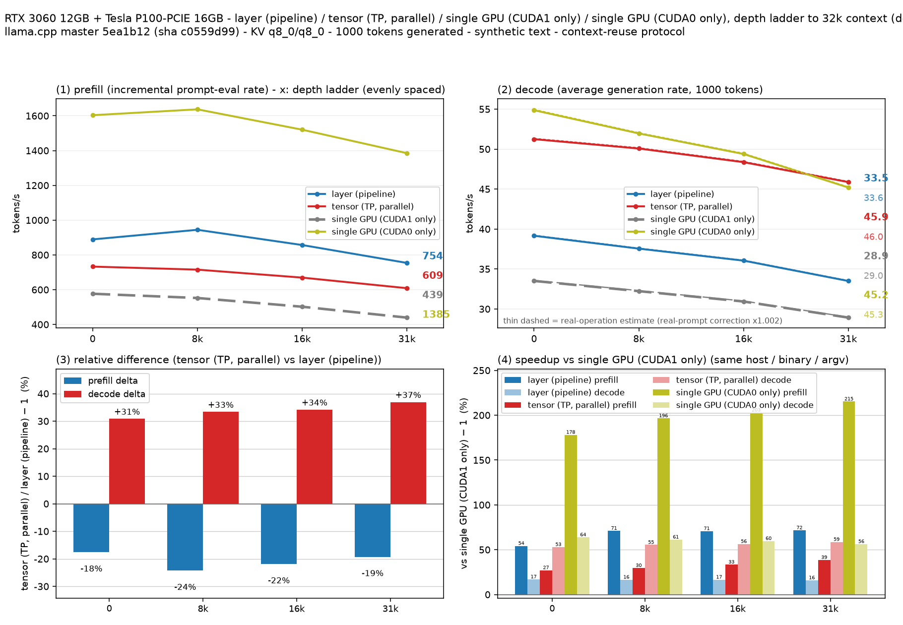
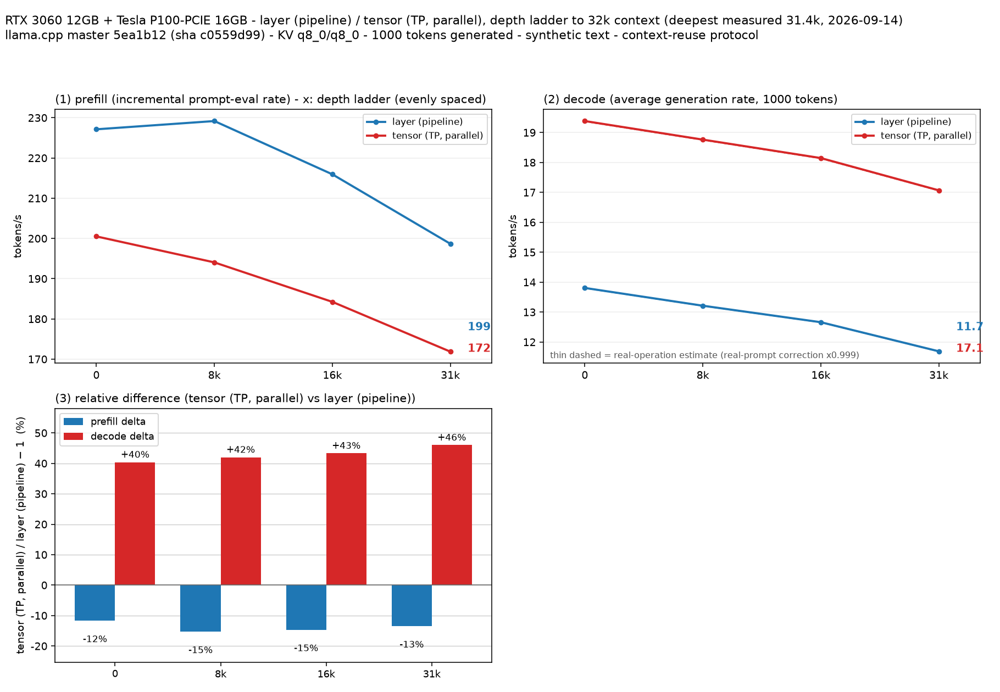

# Results: RTX 3060 12GB + Tesla P100-PCIE 16GB (heterogeneous, no P2P)

Measured with `llama-split-bench` on a two-GPU box whose cards are **different
architectures and cannot do PCIe peer-to-peer**. This is the opposite corner of the
configuration space from the reference 2×V100 run, so the numbers are useful mainly
as a counterexample: several conclusions invert.

## Machine

| | |
|---|---|
| label | `master — NVIDIA GeForce RTX 3060 + Tesla P100-PCIE-16GB` |
| CUDA0 | NVIDIA GeForce RTX 3060, 12 GB, sm86 (Ampere) |
| CUDA1 | Tesla P100-PCIE-16GB, 16 GB, sm60 (Pascal) |
| interconnect | PHB (PCIe host bridge), no NVLink |
| **GPU P2P** | **Not supported** (`nvidia-smi topo -p2p r` → `NS` both directions) |
| CPU / RAM | i7-13700F, 16C/24T / 45 GB |
| driver / CUDA | 580.178.04 / 12.4 |
| llama.cpp | commit `5ea1b12`, CUDA build, `CMAKE_CUDA_ARCHITECTURES=60;86` |

Two binaries were used:

| sha256 (short) | build | NCCL |
|---|---|---|
| `c0559d99324f7d7b` | `build/` | no (`NCCL_LIBRARY-NOTFOUND` at configure time) |
| `b56492f3a931eba8` | `build-nccl/` | yes (NCCL 2.31.2) |

Same commit and same cmake options; the only delta is `NCCL_ROOT`.

## Common settings

```
CTX=32768
STAGES=0,8000,16000,31000
N_PREDICT=1000
PP0_SIZES=512,2048,8192
KV_K=q8_0  KV_V=q8_0  FA=on  THREADS=16
SPEC_ARGS=""          # neither model has an MTP / draft head
```

The README default of `CTX=262144` is not reachable on 28 GB of mixed VRAM, so the
ladder was shortened. The real-prompt correction factor came out at **0.998**, i.e.
the estimate curves sit on top of the measured ones; absolute decode numbers here are
not inflated by speculative acceptance.

---



## 1. Qwen3.5-9B-Q4_K_M — the split is a net loss

Run `full-2`, four arms measured in one run.
`gpu0` = RTX 3060 alone, `single` = P100 alone.

**prefill (t/s)**

| depth | gpu0 (3060) | layer | tensor | single (P100) |
|---:|---:|---:|---:|---:|
| 0 (8192 fresh) | **1611.4** | 951.6 | 721.8 | 555.6 |
| 7.9k | **1637.2** | 944.4 | 715.2 | 552.2 |
| 16k | **1520.1** | 856.8 | 669.4 | 501.9 |
| 31k | **1385.0** | 753.8 | 608.6 | 439.3 |

**decode (t/s)**

| depth | gpu0 (3060) | layer | tensor | single (P100) |
|---:|---:|---:|---:|---:|
| 0 | **54.9** | 39.2 | 51.2 | 33.5 |
| 7.9k | **52.0** | 37.6 | 50.1 | 32.2 |
| 16k | **49.4** | 36.0 | 48.4 | 30.9 |
| 31k | 45.2 | 33.5 | **45.9** | 28.9 |

**The single fast GPU beats every split.** Prefill on the 3060 alone is 1.69–1.84×
layer (the faster split for prefill) and 2.23–2.29× tensor; decode leads until ~31k,
where tensor finally draws level. When a model fits on the faster card, splitting it
across a fast and a slow card costs throughput — the slow card sets the pace.
Splitting here buys VRAM headroom, nothing else.

This is worth stating because a `single` baseline pinned to the *wrong* card inverts
the reading: measured against the P100, tensor looks like a +54% win. Against the
3060 it is a loss. **Pick the baseline device deliberately** (`--mode-spec "gpu0|CUDA0|"`).



## 2. Qwen3.8-27B-Q4_K_M — tensor wins decode, layer wins prefill

Run `t27-1`. 16.8 GB of weights fits on neither card alone, so no single-GPU baseline
exists; layer vs tensor is the only comparison available.

| depth | layer prefill | tensor prefill | layer decode | tensor decode | decode Δ |
|---:|---:|---:|---:|---:|---:|
| 0 | 233.8 | 195.4 | 13.81 | 19.38 | **+40%** |
| 7.9k | 229.2 | 194.0 | 13.21 | 18.76 | **+42%** |
| 16k | 215.9 | 184.2 | 12.66 | 18.15 | **+43%** |
| 31k | 198.7 | 171.9 | 11.69 | 17.07 | **+46%** |

Tensor's decode lead widens with depth, matching the reference box. Prefill goes the
other way — layer is 15–20% faster at every depth, because tensor's per-layer
all-reduce is pure overhead on a compute-bound prefill with no P2P path.

## 3. NCCL on a box with no P2P — helps prefill, hurts decode

The stock `build/` had `GGML_CUDA_NCCL=ON` but NCCL was never found, so
`GGML_USE_NCCL` was not defined and every tensor-split run fell back to the built-in
all-reduce:

```
internal AllReduce init failed (n_devices != 2?); falling back to meta-backend butterfly
```

Rebuilding with NCCL 2.31.2 removes that warning (`ncclCommInitAll ... nranks 2`,
2 channels). All arms below are `--split-mode tensor` on the 27B.

| arm | build | env | decode 0 | decode 31k | prefill 0 | prefill 31k |
|---|---|---|---:|---:|---:|---:|
| B | no NCCL | — | **19.38** | **17.07** | 195.4 | 171.9 |
| C | NCCL | — | 18.28 | 16.09 | **207.6** | **180.7** |
| D | NCCL | `NCCL_P2P_DISABLE=1` | 18.26 | 16.09 | 207.1 | 180.8 |

**NCCL costs ~5.5% decode and gains ~6% prefill**, consistently at every depth:

| depth | decode B→C | prefill B→C |
|---:|---:|---:|
| 0 | −5.7% | +6.2% |
| 7.9k | −5.3% | +6.4% |
| 16k | −5.6% | +5.8% |
| 31k | −5.7% | +5.1% |

With no P2P path, NCCL has to stage through host memory. For decode — one small
all-reduce per token — the built-in butterfly is the lighter path; for prefill's large
batched all-reduce, NCCL's tuning wins. On a C=1 serving box, which is decode-bound,
**not linking NCCL is the faster choice here.**

**C vs D differ by ≤0.2% at every point** — noise. There is no P2P to disable:

```
$ nvidia-smi topo -p2p r
        GPU0    GPU1
 GPU0   X       NS
 GPU1   NS      X
```

`NCCL_P2P_DISABLE=1` is a no-op on this topology. It was applied — `argv-tensor.txt`
in the D run records `env NCCL_P2P_DISABLE=1` ahead of the binary — it simply had
nothing to turn off.

NCCL also logged, on the Pascal card:

```
Compute Capability (60) is not sufficient to enable GIN. Require Volta (70) or newer.
```

---

## Summary

| question | answer on this box |
|---|---|
| layer or tensor? | tensor for decode (+40–46%), layer for prefill (+15–20%) |
| is splitting worth it at all? | only when the model does not fit the faster card |
| does NCCL help? | prefill yes (+6%), decode no (−5.5%); skip it for C=1 serving |
| does `NCCL_P2P_DISABLE` matter? | no — P2P is unsupported between these cards |

## Caveats

- **Heterogeneous, cross-architecture GPUs.** The README already flags TP≥2 as
  unverified in general; this pair (sm60 + sm86, PHB, no P2P) is further from the
  reference box than most. Read these as one data point from a hostile corner, not as
  a general layer-vs-tensor verdict.
- **B was measured on a different binary than C/D.** Same commit, same cmake options,
  `NCCL_ROOT` the only delta — but they are not byte-identical. llama.cpp has no
  runtime switch to disable NCCL once linked, so an exact same-binary B is not
  obtainable without a third build.
- **One run per configuration.** The NCCL effect is 5–6%; the sign is consistent
  across all four depths, but no repeat measurements were taken.
- `single`/`gpu0` for the 9B are the P100 and the 3060 respectively; the 27B has no
  single-GPU arm at all.
